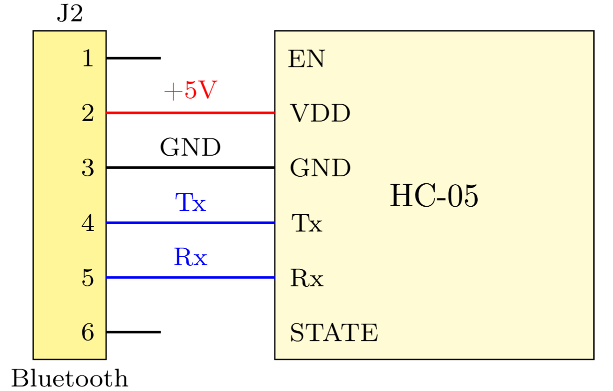
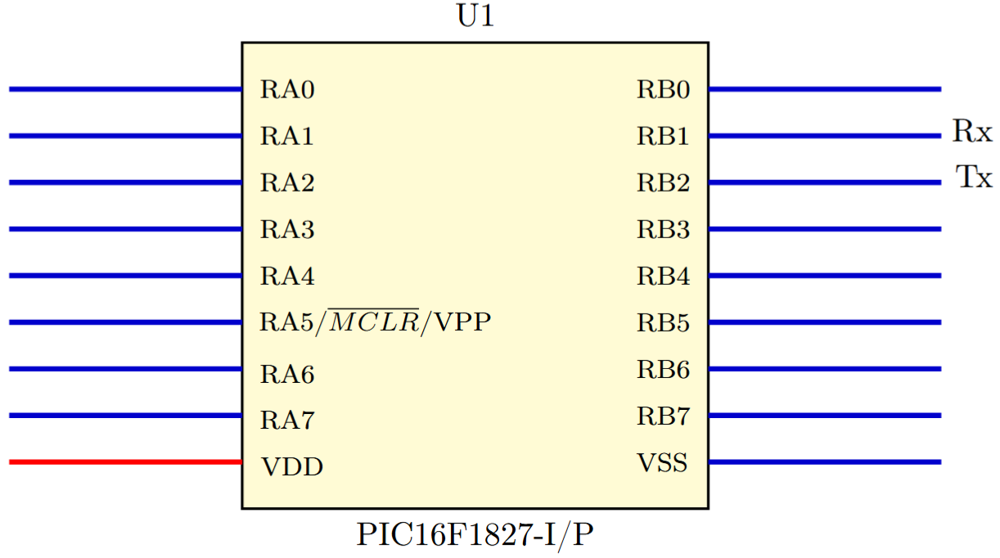

<H1>COMUNiCAÇÃO BLUETOOTH</H1>

Para o projeto bola no tudo, será implementado um sistema de comunicação serial e assíncrono por meio do módulo externo HC-05, capaz de estabelecer conexões via bluetooth Serial Port Protocol (SSP) e o módulo periférico Enhanced Universal Syncronous Asyncronous Receiver Trasmitter (EUSART) do PIC16F1827 através dos pinos Tx e Rx para o envio e recepção dos dados de controle entre o protótipo e um dispositivo externo (celular ou computador).

O firmware desenvolvido deve cumprir os seguintes requisitos:

1. Configuração UART:
   
   - Configuração da comunicação serial assíncrona com baud rate de 115200 BPS, 8 bits de dados contendo 1 bit para indicar o início e o fim da mensagem e sem paridade;
   -  Implementação da detecção do fim do quadro decomunicação por timeout definido por tempo (40 ms) utilizando a interrupção;

3. Transmissão entre o microcontrolador e o dispositivo externo:
   - Envio do byte de dados codificado para as variáveis do projeto: modo de funcionamento, setpoint e medição da altura, no formato hexadecimal como inteiro em big-endian a cada 100ms;
  
4. Recepção entre o dispositivo externo e o microcontrolador:
   - Recepção dos dados codificados para as variáveis do projeto: setpoint da altura, setpoint da posição da válvula e setpoint do ciclo útil do motor, no formato hexadecimal como inteiro em big-endian.

Na Figura 1, está apresentado o esquemático do módulo HC-05 e as conexões Tx e Rx com o módulo bluetooth J2.

  
   
  
  <em>Figura 1: Esquemático do HC-05 e conexões Rx e Tx.</em>
  

Na figura 2, está apresentando o PIC16F1827 evidenciando apenas as conexões Rx e Tx nos pinos RB1 e RB2 sendo, essas, a parte de interesse desse projeto .

  
   
  
  <em>Figura 2: Esquemático do PIC16F1827 e conexões Rx e Tx.</em>
  

<H2>Comunicação serial </H2>

A comunicação e transferência dos dados nestre trabalho será feita utilizando o periférico EUSART e deverá operar nos modos de transmissão e recepção através dos pinos Tx, RB2, e Rx, RB1, de forma assíncrona, com velocidade de cmunicação (baud rate) de 115,200kbps em um quadro de dados de tamanho igual a 10 bits, composto por:

| Estrutura de dados do quadro de comunicação |
|:--------------------------------------------:|
|              b0 = bit de início              |
|                b1 a b8 = dados               |
|              b9 = bit de parada              |

Os dados que serão utilizados neste trabalho estão descritos e, deverão ser recebidos/enviados a depender do modo de operação definido pelo ususário. Todos os dados devem estar no formato hexadecimal como inteiro big-endian. Todos os dados tem 2 bytes de tamanho, com exceção do dado A e seus modos, que possui 1 byte de tamanho. 

| Dado 	|                                      Descrição                                      	|               I/O dado               	|
|:----:	|:-----------------------------------------------------------------------------------:	|:------------------------------------:	|
|   A  	| Modo de funcionamento A0 = manual; A1 = ventoinha; A2 = válvula e A3 = reset. 	| Entrada via software pelo usuário 	|
|   B  	|                                 Setpoint altura (mm)                                	| Entrada via software pelo usuário 	|
|   C  	|                                Medição da altura (mm)                               	|  Entrada leitura do sensor XXXXX  	|
|   D  	|                             Valor médio do tempo de voo                             	|   Saída do cálculo via software   	|
|   E  	|                                     Temperatura                                     	|   Entrada leitura do sensor XXXX  	|
|   F  	|                         Setpoint da válvula (motor de passo)                        	|  Entrada usuário via software  	|
|   G  	|                   Medida da posição da válvula (motor de passo)                  	|   Entrada leitura do sensor XXXX  	|
|   H  	|                        Valor do ciclo útil do PWM (0 a 1023)                        	|   Saída do cálculo via software   	|

Nas Tabelas XX e XX, estão apresentados, respectivamente, os quadro de comunicação para recepção (pc/usuário -> micro) e transmissão de dados (micro -> pc/usuário).

